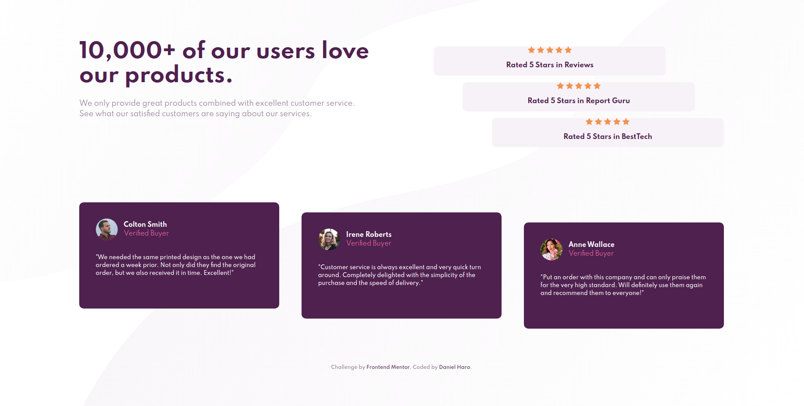

# Frontend Mentor - Social proof section solution

This is a solution to the [Social proof section challenge on Frontend Mentor](https://www.frontendmentor.io/challenges/social-proof-section-6e0qTv_bA). Frontend Mentor challenges help you improve your coding skills by building realistic projects. 

## Table of contents

- [Overview](#overview)
  - [The challenge](#the-challenge)
  - [Screenshot](#screenshot)
  - [Links](#links)
- [My process](#my-process)
  - [Built with](#built-with)
- [Author](#author)

## Overview

### The challenge

Build out this social proof section and get it looking as close to the design as possible.

Users should be able to:

- View the optimal layout for the section depending on their device's screen size

### Screenshot

Here's the finished project:

### Links

- Repository URL: [https://github.com/o0oDanielHaroo0o/social-proof-section](https://github.com/o0oDanielHaroo0o/social-proof-section)
- Live Site URL: [https://o0odanielharoo0o.github.io/social-proof-section/](https://o0odanielharoo0o.github.io/social-proof-section/)

## My process

- I started by analyzing the original design and planning my approach.
- I created the basic HTML structure and gave classes to the elements.
- I typed general styles shared by both mobile and desktop layouts.
- I styled the mobile layout first.
- I made the layout responsive.

### Built with

- Semantic HTML5 markup
- CSS custom properties
- Flexbox
- Mobile-first workflow

## Author

- Frontend Mentor - [@o0oDanielHaroo0o](https://www.frontendmentor.io/profile/o0oDanielHaroo0o)
- GitHub - [o0oDanielHaroo0o](https://github.com/o0oDanielHaroo0o)